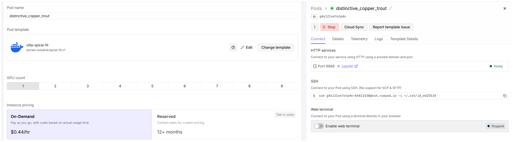
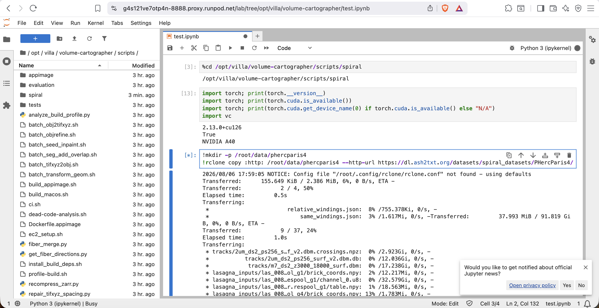

# Spiral Fitting Docker Image

Pre-built Docker image for the [Spiral Fitting Tutorial](https://scrollprize.org/tutorial_spiral) from [ScrollPrize/villa](https://github.com/ScrollPrize/villa). Everything is compiled and installed — just pull the image, download the dataset, and run.

## What's inside

- VC3D binaries (`vc_render_tifxyz`, `flatboi`, etc.) on PATH
- VC Python bindings (`vc.surface_index`, `vc.spiral_sampling`)
- PyTorch with CUDA 12.6
- All spiral fitting Python dependencies
- JupyterLab on port 8888
- rclone for dataset download
- Villa repo at `/opt/villa`

## Pull the image
Pull the [image](https://hub.docker.com/repository/docker/adirik/spiral-fit) from Docker Hub registry.
```bash
docker pull adirik/spiral-fit:v1
```

---

## RunPod

### Template setup
Head over to te [villa-spiral-fit](https://console.runpod.io/deploy?template=g62rbe32re&ref=qrxg3w3w) template and click deploy. Select any GPU pod with sufficient VRAM. 

Alternatively create a new template with:

| Field | Value |
|---|---|
| Container Image | `adirik/spiral-fit:v1` |
| Container Disk | default 120 GB, change based on your dataset and experiment setup |
| Expose HTTP Port | 8888 |





Deploy a pod from the template and connect with SSH. JupyterLab is accessible via the **Connect** button (port 8888). 

### Usage

```bash
# Copy villa to your working directory (/root for RunPod)
cp -r /opt/villa /root/villa

# Download dataset (~90 GB)
mkdir -p /root/data/phercparis4
rclone copy :http: /workspace/data/phercparis4 \
    --http-url https://dl.ash2txt.org/datasets/spiral_datasets/PHercParis4/ \
    --transfers 8 -P

# Edit dataset_path in fit_spiral.py, then run
cd /root/villa/volume-cartographer/scripts/spiral
python fit_spiral.py
```

---

## SLURM with Apptainer

Works on any cluster that has [Apptainer](https://apptainer.org/) — no root required.

```bash
# Pull once (reuse across jobs)
export APPTAINER_CACHEDIR=/scratch/$USER/.apptainer-cache
apptainer pull spiral-fit.sif docker://adirik/spiral-fit:v1
```

To use your own local copy of the villa repo (e.g. for editing spiral fitting, ink segmentation scripts), Apptainer bind-mounts your home directory by default. Override `PYTHONPATH` so your local spiral package takes priority over the one baked into the image:

```bash
#!/bin/bash
#!/bin/bash
#SBATCH --job-name=<your_job>
#SBATCH --nodes=1
#SBATCH --gres=gpu:1
#SBATCH --time=6:00:00
#SBATCH --output=<your_job>-%j.out
module load apptainer

# Edit based on your local villa/ repo path
SPIRAL=$HOME/villa/volume-cartographer/scripts/spiral

apptainer exec --nv spiral-fit.sif \
    env PYTHONPATH="$SPIRAL:$PYTHONPATH" \
    python "$SPIRAL/fit_spiral.py"
```

---

## Other GPU providers

The image works on any platform and GPU rental service that runs Docker with NVIDIA GPU support. Pull the image, expose port 8888 if you want JupyterLab, and follow the same usage steps above. The villa repo is installed at `/opt/villa` to avoid conflicts with provider-specific mount points.

---

## Building from source

The Dockerfile compiles VC3D from source (~50-60 min on native x86_64). 